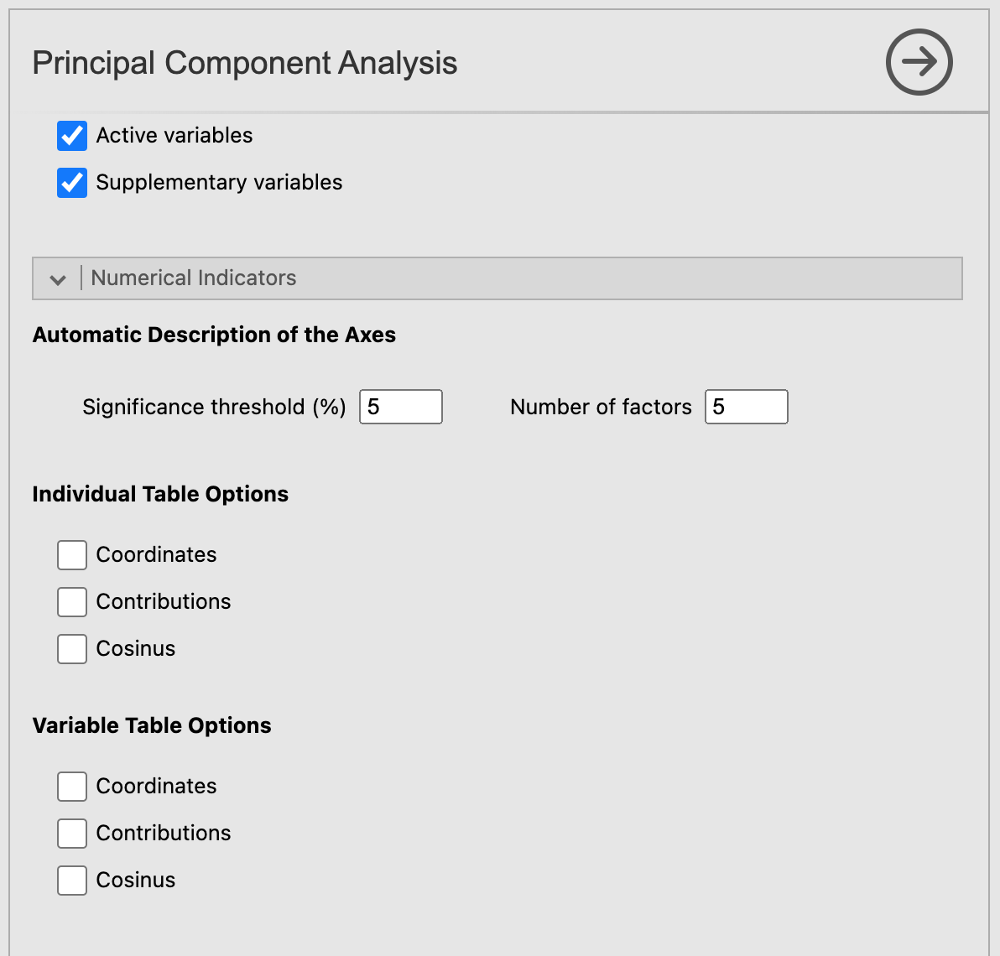

Let's click on the Principal Component Analysis button. The MEDA module allows you to 

```{r PCA1, out.width="80%", fig.align="left", echo=FALSE}
knitr::include_graphics("images/PCA1.png")
```


```{r PCA2, out.width="50%", fig.align="left", echo=FALSE}
knitr::include_graphics("images/PCA2.png")
```


```{r PCA3, out.width="50%", fig.align="left", echo=FALSE}
knitr::include_graphics("images/PCA3.png")
```


```{r PCA4, out.width="50%", fig.align="left", echo=FALSE}

```

